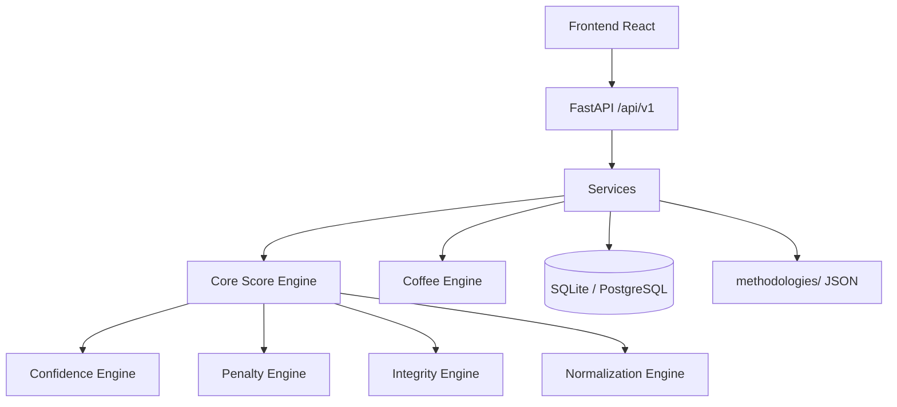

# Arquitectura de Nebula Score®

## Visión general

Nebula Score® es una plataforma multiproducto que evalúa calidad sensorial, control de proceso e integridad de evidencia. Está diseñada para extenderse a café, cacao y vino sin reescribir la lógica central.

## Capas principales

### Core (`backend/app/core/`)

- `methodology.py`: carga y validación de metodologías JSON con Pydantic.
- `engine.py`: orquestador genérico de puntuación.
- `normalization.py`: funciones de clamp y normalización lineal.
- `penalty.py`: motor de penalizaciones.
- `confidence.py`: cálculo del nivel de confianza por mínimo de capacidades.
- `integrity.py`: cálculo del integrity score ponderado.

### Productos (`backend/app/products/`)

Cada producto tiene un motor que adapta el core a sus fórmulas y esquemas. Coffee V1 es el primero.

### Infraestructura (`backend/app/models/`, `database.py`)

SQLAlchemy con SQLite para desarrollo. Las evaluaciones persisten con la metodología y versión usadas, permitiendo reproducir cálculos históricos.

### API (`backend/app/api/`)

Rutas versionadas, documentadas con OpenAPI. La inyección de dependencias de base de datos permite testing con SQLite en memoria.

### Frontend (`frontend/`)

Aplicación React + Vite que consume `/api/v1`. Usa un diseño responsive basado en la paleta de la versión estática anterior.

### Metodologías (`methodologies/`)

JSON versionados que definen pesos, límites, fórmulas, bandas de clasificación, niveles de confianza y categorías de penalización. Permiten ajustar parámetros sin modificar el código.

## Flujo de cálculo

1. El usuario crea una evaluación a través del frontend o API.
2. El servicio carga la metodología para el producto y versión indicados.
3. Se normaliza la calidad sensorial, se calcula el proceso según el modelo, se computa integridad y penalizaciones.
4. Se ponderan los componentes y se limita al rango 0–100.
5. Se calcula el confidence level como el mínimo de las capacidades de equipo, plan y evidencia.
6. Se clasifica según las bandas configuradas y se persisten todos los datos.

## Extensibilidad

Para agregar Cacao o Wine se añade:

1. `methodologies/<producto>/v1.json`
2. `backend/app/products/<producto>/engine.py`
3. Esquemas Pydantic en `backend/app/schemas/` si son necesarios.

El core no requiere cambios si las fórmulas se expresan como ponderaciones y normalizaciones configurables.
